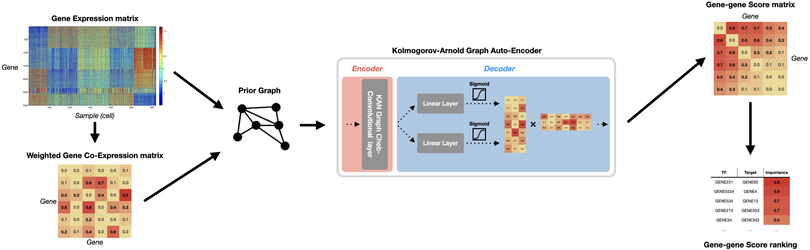

# scKAGAE: Kolmogorov-Arnold Graph Auto-Encoder for semi-supervised Gene Regulatory Networks inference

*See paper for more information on its implementation.*

scKAGAE is a Kolmogorov-Arnold-based model that is designed to infer Gene Regulatory Networks (GRNs) based on scRNA-seq datasets. It uses both the expression matrix and known Transcription Factors as input, and provides you a ranking of all the genes based on the importance of their relationship.

## Abstract
**Motivation:** Gene Regulatory Networks (GRNs) are complex gene interaction networks that are executed at
the local and global level. This makes it challenging to reconstruct those networks when relying on information
that is difficult to interpret. The current models meant for GRN reconstruction have shown promise, but are
limited by their ability to only reconstruct part of a network. This challenge is reinforced when most of the
tasks involves unsupervised or semi-supervised learning at most.

**Results:** We present scKAGAE; A Kolmogorov-Arnold Graph Auto-Encoder which introduces the new
Kolmogorov-Arnold architecture to GRN inference. We evaluate our model on both semi-supervised and
unsupervised tasks, and found that it performs similarly against alternative models for semi-supervised tasks.
For unsupervised tasks, we present factors that could’ve led to poor inference and what should potentially be
investigated to make the model competitive. For inputs, we use a given expression matrix and add known-TF
names in the semi-supervised tasks. Our model overall has shown a smaller architectural overhead needing
only one Convolutional layer for inference, but suffers from instability that rises from its simper architecture.




## Training and inference
Because the model's architecture is exposed in scKAGAE.ipynb, you can easily adapt it for your use. The current parameters are optimized for PBMC-CTL dataset, so you may need to adjust the parameters given other datasets. Be aware that the model is sensitive to hyperparameter changes, so it would be recommended to leave them as is in the current implementation.

Once the data is in the appropriate format, you may run training. It is recommended to use PyTorch with GPU-acceleration (e.g.: CUDA or MPS). The current implementation was tested on Apple's M3 Pro with MacOS.


## Requirements
- Python 3.10 (tested on 3.10.15)
- GraphKan (https://github.com/Ryanfzhang/GraphKan)
- PyTorch Geometric (https://pytorch-geometric.readthedocs.io/en/stable/notes/installation.html)
- PyTorch
- Sci-kit learn
- SciPy
- Plotly
- tqdm
- Pandas
- Numpy

---
## Data pre-processing
In order for the model to work properly, the data needs to be pre-processed in a specific format for it to work seamlessly. The following example uses the notebook's default where it pre-process the PBMC-CTL Dataset.

*PBMC-CTL dataset from:* https://epbmc.immunospot.com

### Pre-processing PBMC-CTL Dataset
This step is meant to convert PBMC-CTL data files into a format that can be processed when processing the correlation matrix from the inputs. This step is necessary because the Graph Auto-Encoder model needs a prior graph to run training on.

*In notebook:*
```Python3
scaler = MinMaxScaler() # Call the sk-learn scaler

# Prepare data
data_pth = 'data/PBMC-CTL_1000_cells.csv'
X = pd.read_csv(data_pth)
y = pd.read_csv('data/PBMC-CTL_Imposed_GRN.csv')
y.columns = ['TF', 'target']

# Prepare X
X = X.iloc[:, 1:] # Fix index (PBMC-CTL)
X.set_index(X['Unnamed: 0'].values, inplace=True) # Fix index (PBMC-CTL)

# Shuffle
X = X.sample(frac=1, axis=0, random_state=2) # Shuffle dataset

X = X.T # (cells, genes) # Transpose to necessary format

# Normalize
X = pd.DataFrame(scaler.fit_transform(X), index=X.index, columns=X.columns) # Normalize the dataset
```

This steps loads and prepare the dataset before the next step. Afterwards, we need to generate the necessary meta-data that is necessary for training (e.g.: the gene names) followed by preparing the known-TF names that are necessary for the semi-supervised task.

```Python3
##########################
# Gene Names
gene_names = X.columns # Extract the gene names
gene_name_dic = {gene: idx for idx, gene in enumerate(gene_names)} # Gene name to index dictionary map (necessary for labeling)
num_genes = len(gene_names) # Set the num_genes for a few methods
# TFs
tf_names = list(set(y['TF']) & set(gene_names)) # Extract the known TF names
tf_indices = [gene_name_dic[tf] for tf in tf_names] # Get the TF indices
```

If you wish to run this on your own dataset, make sure to define all the above meta data, as well as providing a DataFrame *X* (cells x genes) for the expression matrix and y with the columns *TF* and *target* containing gene names in both columns.

---
## Citation
Please cite our paper if you wish to cite this repository.

```
@inproceedings{duchesne2024sckagae,
title={Kolmogorov-Arnold Graph Auto-Encoder for Gene Regulatory Networks inference},
author={Duchesne, Loïc},
pages={1--7},
year={2024},
month={12},
keywords = {Gene Regulatory Network, Kolmogorov-Arnold Network, Graph Auto-Encoder}
}
```